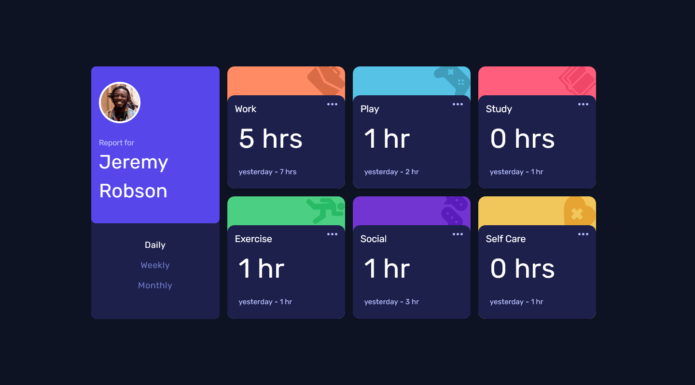

# Frontend Mentor - Time tracking dashboard solution

This is a solution to the [Time tracking dashboard challenge on Frontend Mentor](https://www.frontendmentor.io/challenges/time-tracking-dashboard-UIQ7167Jw). Frontend Mentor challenges help you improve your coding skills by building realistic projects. 

## Table of contents

- [Overview](#overview)
  - [The challenge](#the-challenge)
  - [Screenshot](#screenshot)
  - [Links](#links)
- [My process](#my-process)
  - [Built with](#built-with)
  - [What I learned](#what-i-learned)
  - [Continued development](#continued-development)
  - [Useful resources](#useful-resources)
- [Author](#author)
- [Acknowledgments](#acknowledgments)

## Overview

### The challenge

Users should be able to:

- View the optimal layout for the site depending on their device's screen size
- See hover states for all interactive elements on the page
- Switch between viewing Daily, Weekly, and Monthly stats

### Screenshot




### Links

- Solution URL: [Add solution URL here](https://your-solution-url.com)
- Live Site URL: [Time tracking](https://time-tracking-ckm.netlify.app/)

## My process

### Built with

- Semantic HTML5 markup
- CSS custom properties
- Flexbox
- CSS Grid
- Mobile-first workflow
- [React](https://reactjs.org/) - JS library
- [Material-ui](https://mui.com/material-ui/getting-started/installation/) - CSS Framework

### What I learned

The site has 3 buttons , namely `Daily, weekly and monthly` . When the `Daily` button is clicked , data for current and previous day is populated in the cards, so as when the `Weekly` button is clicked - data for current week and previous week will be populated in the cards. The same will be done when the `Monthly` is clicked. The DataComponent is as follows

```tsx
<Box sx={DataContainer} >
            <Box sx={DataHeadingWrapper}>
                <Typography variant='h2'
                    sx={HeadingH2}>{props.title}</Typography>
                
            </Box>
            <Box
                sx={DurationTrackerWrapper}>
                <Typography paragraph sx={CurrentTime} >
                    {props.currentDuration} {props.currentDuration === 0 || props.currentDuration > 1 ? <abbr>{`hrs`}</abbr> : <abbr>{`hr`}</abbr>}
                </Typography>
                <Typography paragraph sx={PreviousTime}>
                {props.term} {` - `}   {props.previousDuration} {props.previousDuration === 0 || props.previousDuration > 1 ? <abbr>{`hrs`}</abbr> : <abbr>{`hr`}</abbr>}
                </Typography>
            </Box>
        </Box>
```

To improve accessibility for assistive technology, data that has changed should be announced. This can be done by using [ARIA live regions](https://developer.mozilla.org/en-US/docs/Web/Accessibility/ARIA/ARIA_Live_Regions). ARIA live regions fill this gap and provide a way to programmatically expose dynamic content changes in a way that can be announced by assistive technologies. Simple content changes which are not interactive should be marked as live regions. A live region is explicitly denoted using the aria-live attribute.

`aria-live:` The `aria-live=POLITENESS_SETTING` is used to set the priority with which screen reader should treat updates to live regions - the possible settings are: `off, polite or assertive`. The default setting is `off`. This attribute is by far the most important.

Normally, only `aria-live="polite"` is used. Any region which receives updates that are important for the user to receive, but not so rapid as to be annoying, should receive this attribute. The screen reader will speak changes whenever the user is idle.

My partial investigation indicated that although I had set `aria-live="polite"` , i was experiencing some unusual feedback . The updated content was being read letter by letter . Some reasons causing it may include the fact that some of the content was in abbreviation `hr` and `hrs`. Adding `aria-atomic` to the live region gave me the output i was looking for. According to MDN from the link above, here is what `aria-atomic` does:

`aria-atomic`: The `aria-atomic=BOOLEAN` is used to set whether or not the screen reader should always present the live region as a whole, even if only part of the region changes. The possible settings are: false or true. The default setting is false.
### Continued development

- reworking the `handleClick()` function , refactor the following code which has been repeated 3 times

```tsx
 const datum = data.map((item: {
        title: string;
        img: string;
        bg: string;
        timeframes: { monthly: { current: number; previous: number; }; };
      }) => (
        {
          title: item.title,
          img: item.img,
          bg: item.bg,
          currentDuration: item.timeframes.monthly.current,
          previousDuration: item.timeframes.monthly.previous,
          term: 'last month'
        }
      ))
      setTargetData(datum)
```
- the inner object `timeframes` can have one of the following properties `monthly, daily, weekly` . I need to find a way hold these values so as that will prevent repeating the same code. The `term` should also be changed accordingly.

### Useful resources

- [ARIA live regions](https://developer.mozilla.org/en-US/docs/Web/Accessibility/ARIA/ARIA_Live_Regions). See topic above `What I learned` 
- [abbr explained MDN](https://developer.mozilla.org/en-US/docs/Web/HTML/Element/abbr) - using the `abbr` in html

## Author

- Website - [Chamu Mutezva](https://github.com/ChamuMutezva)
- Frontend Mentor - [@ChamuMutezva](https://www.frontendmentor.io/profile/ChamuMutezva)
- Twitter - [@ChamuMutezva](https://twitter.com/ChamuMutezva)

## Acknowledgments


